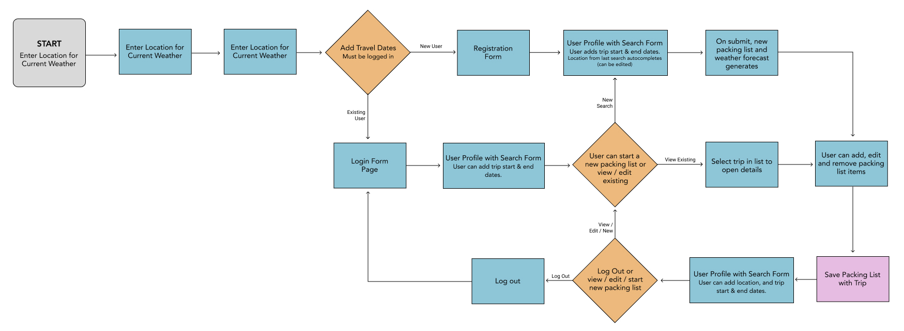

# Capstone Two

### **Project Proposal:** Packable

------

When planning for a trip, travelers often struggle to pack for destinations when they aren't familiar with the location's climate. Also most people  notoriously over-pack for trips, not knowing how many articles of clothing they actually need. The goal of packable is to take the guesswork out of the packing experience. By pulling for a locations past weather data, a user can enter their trip dates and destination, and see likely weather conditions for when they will be there. Further, the app will generate a template packing list based on the number of days the user will be traveling and the climate of their destination. The packing list can then be edited and saved to there user profile. 

------

#### API Info

Packable uses the Timeline Weather API from the Visual Crossing. The Timeline API lets the app retrieve predected forcast data based on historical observations, current 15-day forecasts, and statistical weather forecasts. 

------

#### Database Schema

In Progress...

------

#### User Flow

------

#### Security

User accounts with hashed passwords will allow users to save location searches and associated packing lists they create for trips. 

Any user can see the homepage showing location search, which when submitted will show a user the current conditions in the location they search.

Only logged in users can:

* Search locations with planned travel dates
* Generate packing list based on travel location and climate
* Add, update and save packing lists and location searches

------

#### Potential Issues

If users don't spell a location name correctly, they may get an error or 404 page and have to seaarch again. 

------

#### Stretch Goals

Would like location results to auto-populate a select field as a user types, so they don't have to completely spell a city. Would also like the search to find closest matches if the location spelling is incorrect.
